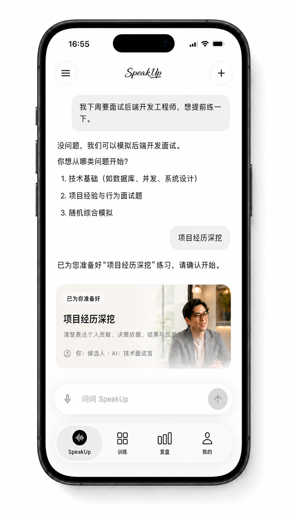
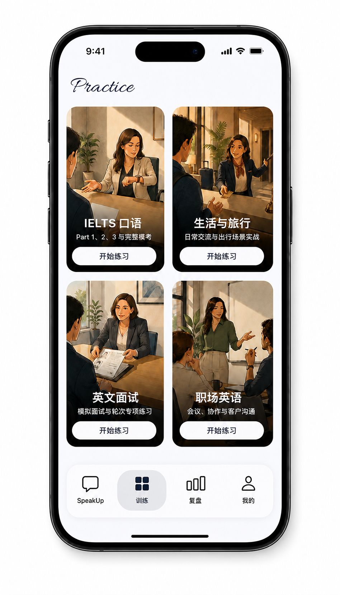
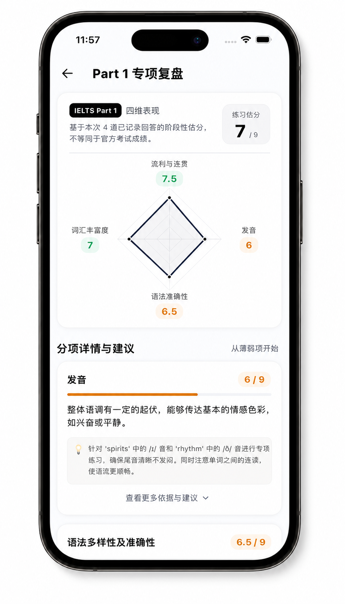
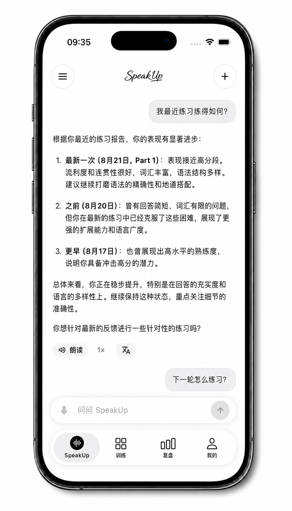
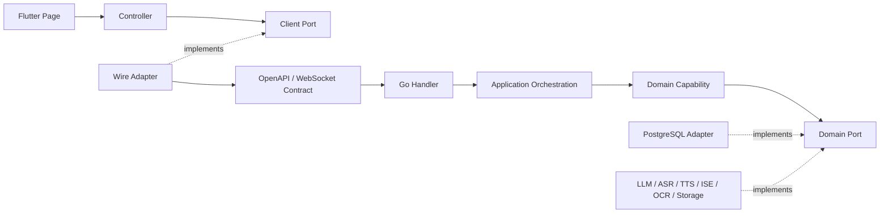

<div align="center">

<br /><br /><br /><br />


**面向真实表达场景的 AI 英语口语陪练**

从模拟面试、IELTS 到职场与生活对话，通过语音练习、即时反馈和复盘巩固，<br />
帮助学习者更自信、更自然地开口表达。

<p>
  <a href="https://speak-up.top"><strong>产品官网</strong></a> ·
  <a href="#features"><strong>核心能力</strong></a> ·
  <a href="#showcase"><strong>产品体验</strong></a> ·
  <a href="#getting-started"><strong>快速开始</strong></a> ·
  <a href="#architecture"><strong>技术架构</strong></a> ·
  <a href="#deployment"><strong>部署交付</strong></a> ·
  <a href="#contributing"><strong>参与开发</strong></a>
</p>

<p>
  <a href="https://github.com/1024XEngineer/XE3-ESL/actions/workflows/quality.yml">
    
  </a>
  <a href="https://github.com/1024XEngineer/XE3-ESL/actions/workflows/quality.yml">
    
  </a>
  <a href="https://github.com/1024XEngineer/XE3-ESL/actions/workflows/quality.yml">
    
  </a>
  
  
  
  <a href="LICENSE">
    
  </a>
</p>

</div>

<a id="showcase"></a>

##  产品体验

<p align="center">
  
  
</p>

<p align="center">
  
  
</p>

<p align="center">
  <sub>理解目标 → 场景实战 → 多维复盘 → 下一步训练建议</sub>
</p>

##  项目在解决什么问题

许多英语学习工具已经能够自由对话、模拟场景、实时纠错和生成报告，却仍把训练路径留给用户：自己判断该练什么、怎样准备、何时进入实战，以及看完报告后如何继续。用户不应该先成为自己的英语老师，才能开始练习。

SpeakUp 将教学准备与真实场景关系分开，形成一个完整的训练闭环：

1. **理解目标**：主 Agent 接住用户当下的意图，判断需要教学、练习还是直接交流。
2. **组织准备**：从完整示范逐步减少帮助，让用户真正能够独立表达。
3. **进入实战**：考官、面试官等场景角色保持身份，通过连续追问检验真实表达。
4. **复盘下一步**：评测从实战中提取证据，再由主 Agent 组织反馈和下一轮训练。

<a id="features"></a>

##  核心能力

| 能力 | 说明 |
| --- | --- |
| **AI 口语陪练** | 支持文字和语音输入、流式回复、语音朗读以及对话记录 |
| **英文模拟面试** | 根据目标岗位、JD 和简历组织多轮面试与专项练习 |
| **IELTS Speaking** | 支持 Part 1、Part 2、Part 3、完整模考和练习报告 |
| **职场英语** | 覆盖需求澄清、跨团队沟通、谈判、冲突处理和方案陈述 |
| **生活与旅行** | 覆盖购物、租房、就医、电话沟通和旅行交通等场景 |
| **逐句改进** | 针对用户表达提供轻量纠错和更自然的英文表达建议 |
| **练习复盘** | 保存练习结果，展示评分、反馈、证据和历史记录 |
| **训练记忆** | 记录学习目标、真实项目、已有改进和反复出现的薄弱点 |

<a id="getting-started"></a>

##  快速开始

### 环境要求

本地开发需要：

- Flutter `3.44.6`
- Go `1.26.6`
- Node.js `22.16` 或更高版本
- Docker 与 Docker Compose
- 一个可用的 Android 真机或 iOS Simulator

### 配置环境变量

从仓库根目录复制本地配置模板：

```shell
cp .env.example .env
```

根据模板注释填写需要启用的服务端能力。不要提交 `.env`、密钥、缓存或构建产物。

### 运行 iOS Simulator

先启动一个 iPhone Simulator，然后执行：

```shell
make dev-ios-simulator
```

该入口会启动 PostgreSQL、执行数据库迁移、运行本地后端并启动 App。

由于数字人 SDK 的模拟器限制，iOS Simulator 会明确禁用数字人能力，并沿用真实后端的语音与文字降级链路。

### 运行 Android 真机

连接并授权一台 arm64 Android 设备，然后执行：

```shell
make dev-android
```

连接多个设备时，可以指定设备 ID：

```shell
ANDROID_DEVICE_ID=<设备 ID> make dev-android
```

更多移动端开发、签名和发布说明见 [`mobile/README.md`](mobile/README.md)。

<a id="architecture"></a>

##  技术架构



代码依赖保持为：

> 客户端页面 → Controller → Client Port ← Wire Adapter → 传输契约 → 服务端入口 → 应用编排 → 领域能力 → Port ← PostgreSQL / Provider Adapter

SpeakUp 采用按业务能力拆分的模块化单体。业务状态由对应领域模块唯一持有；客户端断线后重新读取服务端权威状态，供应商错误由 Adapter 映射并交给应用编排决定失败或重试。LLM、语音、评测、OCR 和对象存储均通过 Port / Adapter 接入，不反向决定业务流程。

架构设计与扩展规则：

- [当前代码模块与协作主链](https://github.com/1024XEngineer/XE3-ESL/issues/456)
- [代码归类、状态所有权与失败边界](https://github.com/1024XEngineer/XE3-ESL/issues/461)

##  仓库结构

```text
XE3-ESL/
├── mobile/    # Flutter Android/iOS 客户端与 Feature 组合
├── server/    # Go 业务模块、应用装配、数据与供应商实现
├── api/       # OpenAPI、WebSocket Schema 与契约校验
├── portal/    # 产品门户、体验报名、下载页和运营入口
├── deploy/    # Staging、Production、TLS、监控与分发契约
├── docs/      # 产品、设计和工程文档
└── tools/     # 本地开发、发布验证和专项检查脚本
```

核心训练链由 `mobile/`、`server/` 与 `api/` 共同实现；`portal/` 承载产品门户与分发入口，`deploy/` 固化从候选版本到生产发布、监控和回滚的交付契约。

<a id="deployment"></a>

##  部署与交付

SpeakUp 使用同一份 `release-manifest.json` 贯穿候选版本、Staging、Production 和 Android 分发，以镜像摘要、数据库版本、健康检查与不可变回执固定每次交付结果。

| 环节 | 交付保障 |
| --- | --- |
| [Staging](deploy/staging/README.md) | 隔离的 Compose 项目、网络与数据卷；固定镜像摘要；迁移先行；健康检查、部署回执与真实业务 UAT |
| [Production](deploy/production/README.md) | 不可变镜像发布；备份与隔离恢复门禁；Schema 演练；原子 Nginx 切换与可追溯回滚 |
| [TLS](deploy/tls/README.md) | 精确 SAN 证书、HTTP-01 引导、续期验证、Nginx 激活与定时健康检查 |
| [Observability](deploy/observability/README.md) | Prometheus、Alertmanager、Grafana、Blackbox 探测、产品健康看板与站外 Production Probe |
| [Android 分发](deploy/android-download/README.md) | 正式签名 APK 校验、版本化不可变文件、SHA-256、原子激活与历史版本回滚 |

部署契约可在不接触服务器的情况下复现检查：

```shell
make check-staging-deploy
make check-production-deploy
make check-production-backup
make check-production-rehearsal
make check-tls-lifecycle
make check-observability
make check-android-download
```

##  质量检查

SpeakUp 的测试体系围绕真实行为与关键链路组织：

- **单元测试**：覆盖 Flutter Controller、状态转换、序列化以及 Go 领域规则和应用编排。
- **集成测试**：覆盖 PostgreSQL Repository、数据库迁移、备份恢复和服务端模块串联。
- **契约测试**：校验 OpenAPI、WebSocket、JSON Schema、安全边界和评估结果结构。
- **核心流程验证**：覆盖场景练习、IELTS、复盘恢复、Android 发布守卫和 Production 演练。
- **覆盖率门禁**：CI 采集 Go 与 Flutter 覆盖率，在 Pull Request 中展示变化并阻止覆盖率回退。

从仓库根目录执行完整检查：

```shell
make check
```

也可以分别运行：

```shell
make check-flutter
make check-go
make check-api
```

所有合入 `dev` 或 `main` 的改动都必须通过对应 Pull Request 的相关检查。

<a id="contributing"></a>

##  参与开发

SpeakUp 使用短分支和 Pull Request 协作：

1. 从最新的 `upstream/dev` 创建范围单一的任务分支。
2. 每个分支关联一个验收清楚的 Issue。
3. Commit 信息遵循 [Conventional Commits](https://www.conventionalcommits.org/zh-hans/v1.0.0/)。
4. 通过个人 Fork 向官方仓库的 `dev` 提交 Pull Request。
5. 在合入前完成相关测试、构建、契约校验和人工 Review。

正式发布通过 `dev → main` 的 Release Pull Request 完成，不直接向 `dev` 或 `main` 推送功能提交。

##  Contributors

感谢每一位参与产品设计、工程实现、测试与交付的贡献者。

<a href="https://github.com/1024XEngineer/XE3-ESL/graphs/contributors">
  
</a>

##  License

SpeakUp 基于 [MIT License](LICENSE) 开源。
